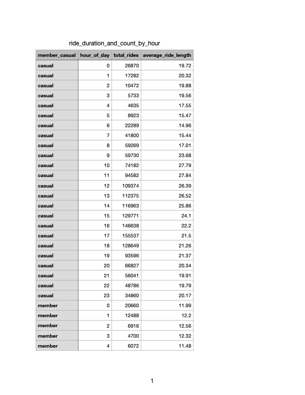

# Case Study: Cyclistic Bike-Share Analysis (Google Data Analytics Capstone)

## Introduction

This project analyzes the Cyclistic Bike-Share case study, developed as part of the Google Data Analytics Professional Certificate capstone. The objective is to answer key business questions by applying the six-step data analysis process: Ask, Prepare, Process, Analyze, Share, and Act.

## Background

Cyclistic is a bike-share program based in Chicago, offering 5,824 bicycles and 692 docking stations throughout the city. Unlike many competitors, Cyclistic provides a variety of bicycle types—including reclining bikes, hand tricycles, and cargo bikes—designed to accommodate riders with different needs, making the service more inclusive and accessible.

The company offers flexible pricing plans, including single-ride passes, full-day passes, and annual memberships. While this approach appeals to a broad range of users, the company’s marketing director believes that long-term success depends on increasing the number of annual members.

## Scenario

For the purposes of this case study, I assume the role of a junior data analyst on Cyclistic’s marketing analytics team. The objective is to analyze rider behavior and present findings and recommendations to key stakeholders, including Marketing Director Lily Moreno and the Cyclistic executive team.
 
## Step 1: Ask

The business task is to analyze how annual members and casual riders use Cyclistic bikes differently. By identifying usage patterns over time, the marketing team can develop targeted strategies aimed at converting more casual riders into annual members. 

## Step 2: Prepare

### Does the Data ROCCC?

To ensure the quality of this analysis, the data must be Reliable, Original, Comprehensive, Current, and Cited (ROCCC). The dataset used in this project consists of historical trip data from Divvy, Chicago’s bike-share system, from September 8th 2024 to September 8th 2025. The data was made publicly available by Motivate International Inc. under their Data License Agreement. The data is also public and anonymized to protect riders' privacy. It excludes any personally identifiable information such as names, phone numbers, or payment details.

Applying the ROCCC framework:
- Reliable & Original: The data comes directly from a primary source (Divvy) and reflects actual trip history.
- Comprehensive: It includes all necessary fields to analyze usage patterns between member types.
- Current: Data is from September 2024-Septemeber 2025 which is very current.
- Cited: The data source is publicly documented and licensed appropriately.

### Preparing RStudio

To start the analysis, we first set up the R environment in RStudio. We installed and loaded the tidyverse package, which gives us a powerful collection of tools for manipulating and visualizing the data.

```r
install.packages("tidyverse")

library(tidyverse)
```

### Data Consolidation

All raw data, which were stored in individual CSV files, were imported and combined into a single datafrane. The analysis identified all files with a .csv extension in the project directory, then read each one and combined them row-wise into a final data frame called combined_data.

```r
all_files <- list.files(
  path = ".", 
  pattern = "\\.csv$", 
  full.names = TRUE 
)

combined_data <- map_dfr(all_files, read_csv)
```

## Step 3: Process

### Data Cleaning 

Unnecessary columns were removed, and duplicate rows were eliminated to ensure data integrity. Missing values were also removed to prevent them from skewing the analysis.

```r
combined_data <- combined_data %>%
  select(-rideable_type, 
         -start_station_id, 
         -end_station_id, 
         -start_lat, 
         -start_lng, 
         -end_lat, 
         -end_lng)

combined_data <- combined_data %>%
  distinct() %>% 
  drop_na()
```

### Data Transformation

New columns were created from the existing timestamp data to extract useful information for the analysis. This included extracting the date, month, day_of_week, year, hour_of_day, and calculating ride_length in minutes.

```r
combined_data <- combined_data %>%
  mutate(
    date = as.Date(started_at), 
    month = lubridate::month(started_at, label = TRUE), 
    day = lubridate::day(started_at), 
    year = lubridate::year(started_at), 
    day_of_week = lubridate::wday(started_at, label = TRUE),
    hour_of_day = lubridate::hour(started_at), 
    ride_length = round(as.numeric(difftime(ended_at, started_at, units = "mins")), 2)
  )
```

### Data Filtering

The final step in the process phase involved filtering the dataset to remove any invalid ride entries. This included rides with a duration of zero or less, as well as those that were excessively long (over 24 hours), ensuring that the analysis focused on valid user activity.

```r
combined_data <- combined_data %>%
  filter(ride_length > 0 & ride_length < 1440)
```

## Step 4: Analyze

### Descriptive Analysis on Ride Length by User Type

After cleaning and manipulating the data, descriptive statistics were calculated to understand ride duration based on membership type. The mean, median, minimum, and maximum ride lengths were summarized for both "member" and "casual" riders. The results of this summary were then saved to a CSV file named ride_duration_stats.csv for further reference

```r
ride_duration_stats <- combined_data %>%
  group_by(member_casual) %>%
  summarize(
    mean_ride_length = round(mean(ride_length), 2),
    median_ride_length = round(median(ride_length), 2),
    min_ride_length = round(min(ride_length), 2),
    max_ride_length = round(max(ride_length), 2)
  )

write_csv(ride_duration_stats, "ride_duration_stats.csv")
```

The data table below shows...

 

### Analyzing Daily Usage Trend by User Type

Further analysis was performed to understand daily rider behavior. The data was grouped by both member type and day of the week to calculate the total number of rides and the average ride length. This summary was then saved to a CSV file named ride_duration_and_count_by_weekday.csv for documentation and further analysis.

```r
ride_duration_and_count_by_weekday <- combined_data %>%
  group_by(member_casual, day_of_week) %>%
  summarize(
    total_rides = n(),
    average_ride_length = round(mean(ride_length), 2)
  )

write_csv(ride_duration_and_count_by_weekday, "ride_duration_and_count_by_weekday.csv")
```

The table below shows...

 

### Analyzing Monthly Usage Trends by User Type

To further explore rider behavior, a summary was created to analyze monthly trends in ride duration and count. The data was grouped by member type and month to calculate the total number of rides and the average ride length. This summary was then saved to a CSV file named ride_duration_and_count_by_month.csv

```r
ride_duration_and_count_by_month <- combined_data %>%
  group_by(member_casual, month) %>%
  summarize(
    total_rides = n(),
    average_ride_length = round(mean(ride_length), 2)
  )

write_csv(ride_duration_and_count_by_month, "ride_duration_and_count_by_month.csv")
```

The table below shows...

  

### Analyzing Hourly Usage Trends by User Type

To provide a more granular view of daily ridership, the data was further summarized to analyze hourly trends. The data was grouped by member type and hour of the day, allowing for the calculation of total rides and average ride length for each hour. This summary was then saved to a CSV file named ride_duration_and_count_by_hour.csv.

```r
ride_duration_and_count_by_hour <- combined_data %>%
  group_by(member_casual, hour_of_day) %>%
  summarize(
    total_rides = n(),
    average_ride_length = round(mean(ride_length), 2)
  )

write_csv(ride_duration_and_count_by_hour, "ride_duration_and_count_by_hour.csv")
```

The table below shows...

 

### Analyzing Top 10 Start Stations by User Type

To understand ridership patterns across different station locations, the top 10 most popular starting stations were identified and compared between casual and member riders. The data was first counted by member type and station name, then grouped by member type, and finally, the top 10 stations with the highest total ride count were selected for each group. The final result was sorted and saved to a CSV file named top_10_starting_stations.csv

```r
top_10_starting_stations <- combined_data %>%
  count(member_casual, start_station_name, name = "total_rides") %>%
  group_by(member_casual) %>%
  slice_max(order_by = total_rides, n = 10) %>%
  arrange(member_casual, desc(total_rides))

write_csv(top_10_starting_stations, "top_10_starting_stations.csv")
```
The table below shows...

 


