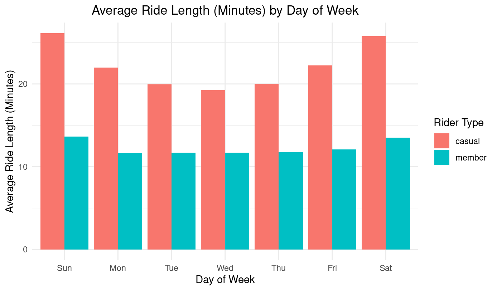
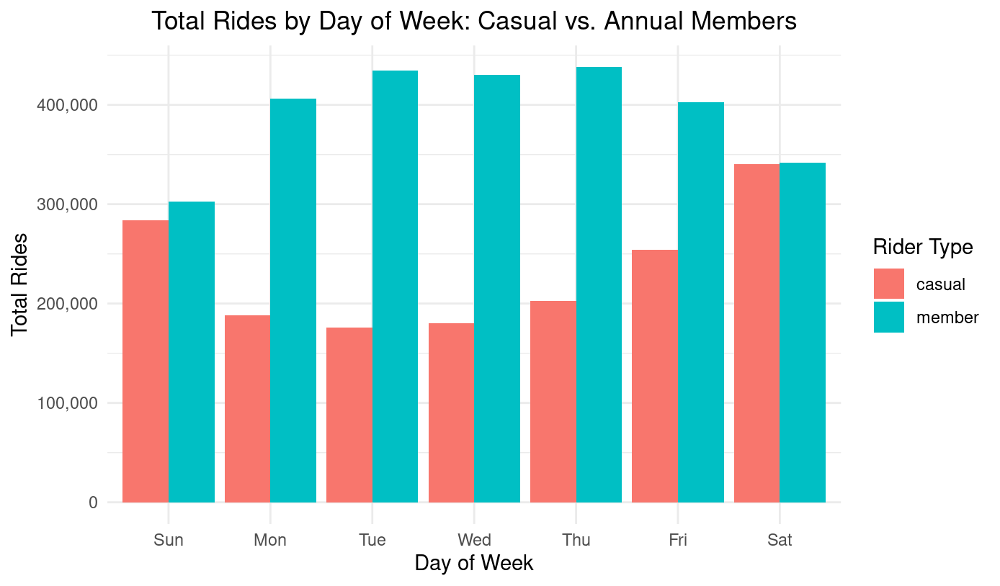
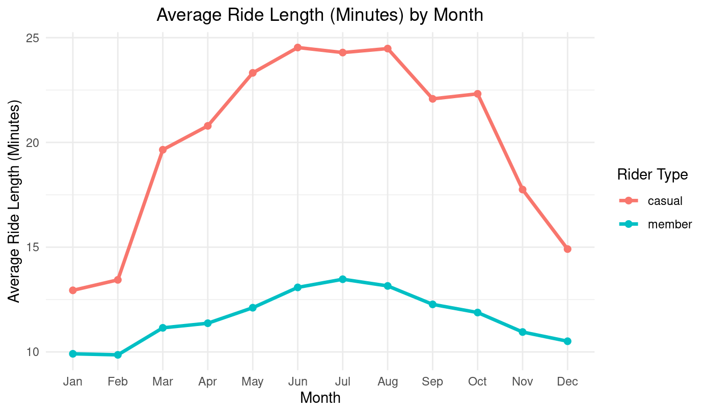
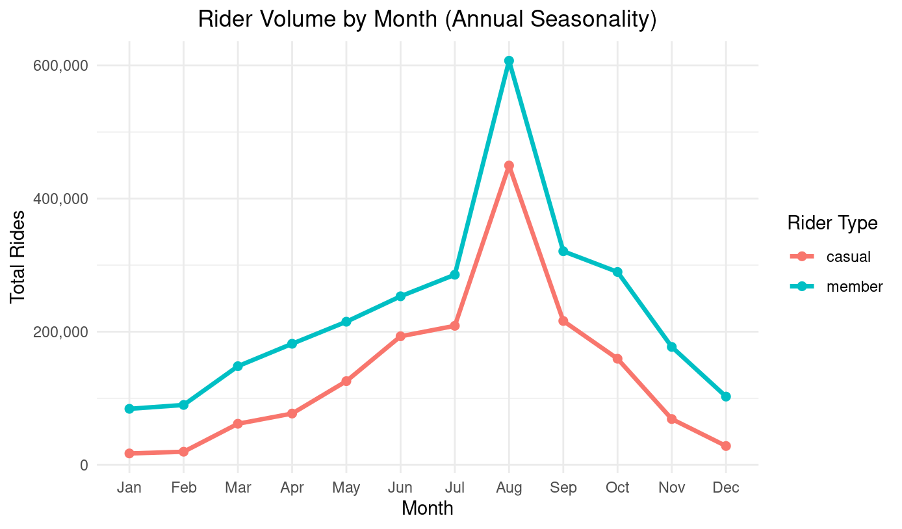
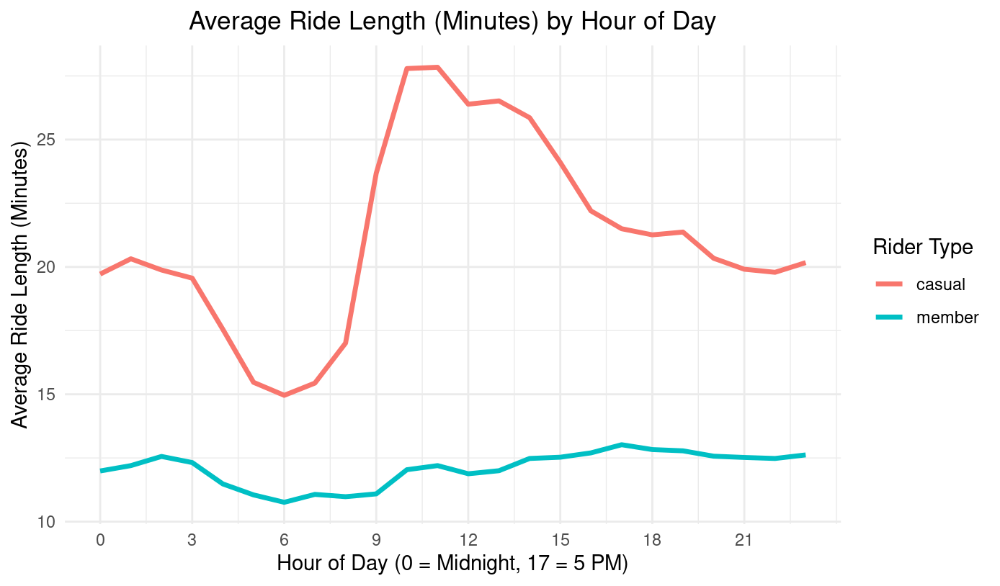
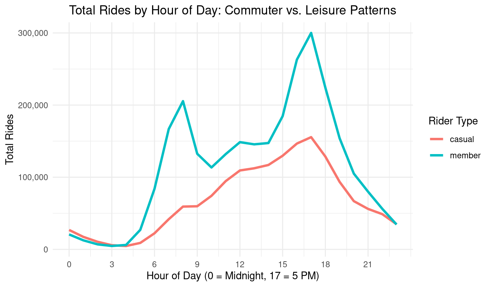
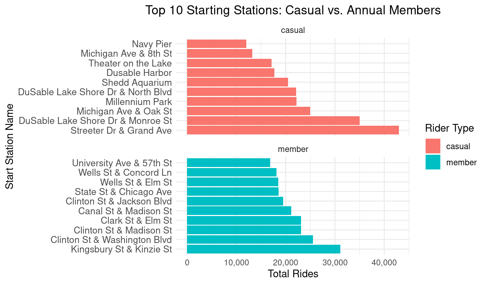

# Case Study: Cyclistic Bike-Share Analysis (Google Data Analytics Capstone)

## Introduction

This project analyzes the Cyclistic Bike-Share case study, developed as part of the Google Data Analytics Professional Certificate capstone. The objective is to answer key business questions by applying the six-step data analysis process: Ask, Prepare, Process, Analyze, Share, and Act.

## Background

Cyclistic is a bike-share program based in Chicago, offering 5,824 bicycles and 692 docking stations throughout the city. Unlike many competitors, Cyclistic provides a variety of bicycle types—including reclining bikes, hand tricycles, and cargo bikes—designed to accommodate riders with different needs, making the service more inclusive and accessible.

The company offers flexible pricing plans, including single-ride passes, full-day passes, and annual memberships. While this approach appeals to a broad range of users, the company’s marketing director believes that long-term success depends on increasing the number of annual members.

## Scenario

For the purposes of this case study, I assume the role of a junior data analyst on Cyclistic’s marketing analytics team. The objective is to analyze rider behavior and present findings and recommendations to key stakeholders, including Marketing Director Lily Moreno and the Cyclistic executive team.
 
## Step 1: Ask

The business task is to analyze how annual members and casual riders use Cyclistic bikes differently in order to increase annual memberships. By identifying usage patterns over time, the marketing team can develop targeted strategies aimed at converting more casual riders into annual members. 

## Step 2: Prepare

### Does the Data ROCCC?

To ensure the quality of this analysis, the data must be Reliable, Original, Comprehensive, Current, and Cited (ROCCC). The dataset used in this project consists of historical trip data from Divvy, Chicago’s bike-share system, from September 8th 2024 to September 8th 2025. The data was made publicly available by Motivate International Inc. under their Data License Agreement. The data is also public and anonymized to protect riders' privacy. It excludes any personally identifiable information such as names, phone numbers, or payment details. The raw data, once combined, is estimated to contain over 5.4 million total rides.

Applying the ROCCC framework:
- Reliable & Original: The data comes directly from a primary source (Divvy) and reflects actual trip history.
- Comprehensive: It includes all necessary fields to analyze usage patterns between member types.
- Current: Data is from September 2024-September 2025 which is very current.
- Cited: The data source is publicly documented and licensed appropriately.

### Preparing RStudio

To start the analysis, we first set up the R environment in RStudio. We installed and loaded the tidyverse package, which gives us a powerful collection of tools for manipulating and visualizing the data.

```r
install.packages("tidyverse")

library(tidyverse)
```

### Data Consolidation

All raw data, which were stored in individual CSV files, were imported and combined into a single dataframe. The analysis identified all files with a .csv extension in the project directory, then read each one and combined them row-wise into a final data frame called combined_data.

```r
all_files <- list.files(
  path = ".", 
  pattern = "\\.csv$", 
  full.names = TRUE 
)

combined_data <- map_dfr(all_files, read_csv)
```

## Step 3: Process

### Data Cleaning 

Unnecessary columns were removed, and duplicate rows were eliminated to ensure data integrity. Missing values were also removed to prevent them from skewing the analysis.

```r
combined_data <- combined_data %>%
  select(-rideable_type, 
         -start_station_id, 
         -end_station_id, 
         -start_lat, 
         -start_lng, 
         -end_lat, 
         -end_lng)

combined_data <- combined_data %>%
  distinct() %>% 
  drop_na()
```

### Data Transformation

New columns were created from the existing timestamp data to extract useful information for the analysis. This included extracting the date, month, day_of_week, year, hour_of_day, and calculating ride_length in minutes.

```r
combined_data <- combined_data %>%
  mutate(
    date = as.Date(started_at), 
    month = lubridate::month(started_at, label = TRUE), 
    day = lubridate::day(started_at), 
    year = lubridate::year(started_at), 
    day_of_week = lubridate::wday(started_at, label = TRUE),
    hour_of_day = lubridate::hour(started_at), 
    ride_length = round(as.numeric(difftime(ended_at, started_at, units = "mins")), 2)
  )
```

### Data Filtering

The final step in the process phase involved filtering the dataset to remove any invalid ride entries. This included rides with a duration of zero or less, as well as those that were excessively long (over 24 hours), ensuring that the analysis focused on valid user activity.

```r
combined_data <- combined_data %>%
  filter(ride_length > 0 & ride_length < 1440)
```

## Step 4: Analyze

### Descriptive Analysis on Ride Length by User Type

After cleaning and manipulating the data, descriptive statistics were calculated to understand ride duration based on membership type. The mean, median, minimum, and maximum ride lengths were summarized for both "member" and "casual" riders. The results of this summary were then saved to a CSV file named ride_duration_stats.csv for further reference

```r
ride_duration_stats <- combined_data %>%
  group_by(member_casual) %>%
  summarize(
    mean_ride_length = round(mean(ride_length), 2),
    median_ride_length = round(median(ride_length), 2),
    min_ride_length = round(min(ride_length), 2),
    max_ride_length = round(max(ride_length), 2)
  )

write_csv(ride_duration_stats, "ride_duration_stats.csv")
```

The table below shows the descriptive statistics for ride length in minutes, comparing casual and annual members. Specifically, it summarizes the mean, median, minimum, and maximum ride duration for each user type.

| member_casual 	| mean_ride_length 	| median_ride_length 	| min_ride_length 	| max_ride_length 	|
|---------------	|------------------	|--------------------	|-----------------	|-----------------	|
| casual        	| 22.78            	| 13.02              	| 0.01            	| 1439.76         	|
| member        	| 12.19            	| 8.72               	| 0.01            	| 1436.97         	|

* Casual riders have a much higher mean ride length (22.78 min) compared to annual members (12.19 min), suggesting they use the bikes for longer, possibly recreational rides, while annual members use them for commutes/quick trips.

### Analyzing Daily Usage Trend by User Type

Further analysis was performed to understand daily rider behavior. The data was grouped by both member type and day of the week to calculate the total number of rides and the average ride length. This summary was then saved to a CSV file named ride_duration_and_count_by_weekday.csv for documentation and further analysis.

```r
ride_duration_and_count_by_day <- combined_data %>%
  group_by(member_casual, day_of_week) %>%
  summarize(
    total_rides = n(),
    average_ride_length = round(mean(ride_length), 2)
  )

write_csv(ride_duration_and_count_by_day, "ride_duration_and_count_by_day.csv")
```

The table below shows the daily usage patterns for casual and member riders. It presents the total number of rides and the average ride length (in minutes), aggregated by member type and day of the week.

| member_casual 	| day_of_week 	| total_rides 	| average_ride_length 	|
|---------------	|-------------	|-------------	|---------------------	|
| casual        	| Sun         	| 284143      	| 26.11               	|
| casual        	| Mon         	| 188447      	| 21.99               	|
| casual        	| Tue         	| 175543      	| 19.93               	|
| casual        	| Wed         	| 180085      	| 19.27               	|
| casual        	| Thu         	| 202471      	| 20.01               	|
| casual        	| Fri         	| 254276      	| 22.25               	|
| casual        	| Sat         	| 340219      	| 25.78               	|
| member        	| Sun         	| 302963      	| 13.63               	|
| member        	| Mon         	| 405925      	| 11.65               	|
| member        	| Tue         	| 434190      	| 11.7                	|
| member        	| Wed         	| 430217      	| 11.69               	|
| member        	| Thu         	| 437814      	| 11.72               	|
| member        	| Fri         	| 402533      	| 12.08               	|
| member        	| Sat         	| 341605      	| 13.52               	|

* Casual riders peak heavily on weekends (Sat/Sun), while member ridership is highest and consistent Monday-Thursday, indicating a commuter pattern for annual members.

### Analyzing Monthly Usage Trends by User Type

To further explore rider behavior, a summary was created to analyze monthly trends in ride duration and count. The data was grouped by member type and month to calculate the total number of rides and the average ride length. This summary was then saved to a CSV file named ride_duration_and_count_by_month.csv

```r
ride_duration_and_count_by_month <- combined_data %>%
  group_by(member_casual, month) %>%
  summarize(
    total_rides = n(),
    average_ride_length = round(mean(ride_length), 2)
  )

write_csv(ride_duration_and_count_by_month, "ride_duration_and_count_by_month.csv")
```
The table below shows the monthly trends in ridership, summarizing the total number of rides and the average ride length (in minutes), categorized by member type and month.

| member_casual 	| month 	| total_rides 	| average_ride_length 	|
|---------------	|-------	|-------------	|---------------------	|
| casual        	| Jan   	| 17090       	| 12.94               	|
| casual        	| Feb   	| 19631       	| 13.44               	|
| casual        	| Mar   	| 61667       	| 19.65               	|
| casual        	| Apr   	| 77014       	| 20.79               	|
| casual        	| May   	| 125685      	| 23.32               	|
| casual        	| Jun   	| 193111      	| 24.53               	|
| casual        	| Jul   	| 208821      	| 24.29               	|
| casual        	| Aug   	| 449650      	| 24.48               	|
| casual        	| Sep   	| 216132      	| 22.08               	|
| casual        	| Oct   	| 159340      	| 22.32               	|
| casual        	| Nov   	| 68795       	| 17.75               	|
| casual        	| Dec   	| 28248       	| 14.91               	|
| member        	| Jan   	| 84121       	| 9.91                	|
| member        	| Feb   	| 89945       	| 9.86                	|
| member        	| Mar   	| 148160      	| 11.15               	|
| member        	| Apr   	| 181857      	| 11.37               	|
| member        	| May   	| 215008      	| 12.11               	|
| member        	| Jun   	| 253190      	| 13.08               	|
| member        	| Jul   	| 285590      	| 13.47               	|
| member        	| Aug   	| 607118      	| 13.15               	|
| member        	| Sep   	| 320853      	| 12.27               	|
| member        	| Oct   	| 289761      	| 11.88               	|
| member        	| Nov   	| 177129      	| 10.95               	|
| member        	| Dec   	| 102515      	| 10.51               	|

* Both groups have clear seasonal peaks (Summer/Fall), but the difference in average ride length is largest during these peak months, reinforcing the recreational use by casuals during warm weather.

### Analyzing Hourly Usage Trends by User Type

To provide a more granular view of daily ridership, the data was further summarized to analyze hourly trends. The data was grouped by member type and hour of the day, allowing for the calculation of total rides and average ride length for each hour. This summary was then saved to a CSV file named ride_duration_and_count_by_hour.csv.

```r
ride_duration_and_count_by_hour <- combined_data %>%
  group_by(member_casual, hour_of_day) %>%
  summarize(
    total_rides = n(),
    average_ride_length = round(mean(ride_length), 2)
  )

write_csv(ride_duration_and_count_by_hour, "ride_duration_and_count_by_hour.csv")
```
The table below shows a granular view of daily ridership, summarizing the total number of rides and the average ride length (in minutes), broken down by member type and hour of the day (0−23).

| member_casual 	| hour_of_day 	| total_rides 	| average_ride_length 	|
|---------------	|-------------	|-------------	|---------------------	|
| casual        	| 0           	| 26870       	| 19.72               	|
| casual        	| 1           	| 17282       	| 20.32               	|
| casual        	| 2           	| 10472       	| 19.88               	|
| casual        	| 3           	| 5733        	| 19.56               	|
| casual        	| 4           	| 4635        	| 17.55               	|
| casual        	| 5           	| 8923        	| 15.47               	|
| casual        	| 6           	| 22289       	| 14.96               	|
| casual        	| 7           	| 41800       	| 15.44               	|
| casual        	| 8           	| 59269       	| 17.01               	|
| casual        	| 9           	| 59730       	| 23.68               	|
| casual        	| 10          	| 74182       	| 27.79               	|
| casual        	| 11          	| 94582       	| 27.84               	|
| casual        	| 12          	| 109374      	| 26.39               	|
| casual        	| 13          	| 112375      	| 26.52               	|
| casual        	| 14          	| 116963      	| 25.86               	|
| casual        	| 15          	| 129771      	| 24.1                	|
| casual        	| 16          	| 146638      	| 22.2                	|
| casual        	| 17          	| 155537      	| 21.5                	|
| casual        	| 18          	| 128649      	| 21.26               	|
| casual        	| 19          	| 93596       	| 21.37               	|
| casual        	| 20          	| 66827       	| 20.34               	|
| casual        	| 21          	| 56041       	| 19.91               	|
| casual        	| 22          	| 48786       	| 19.79               	|
| casual        	| 23          	| 34860       	| 20.17               	|
| member        	| 0           	| 20660       	| 11.99               	|
| member        	| 1           	| 12488       	| 12.2                	|
| member        	| 2           	| 6916        	| 12.56               	|
| member        	| 3           	| 4700        	| 12.32               	|
| member        	| 4           	| 6072        	| 11.48               	|
| member        	| 5           	| 27044       	| 11.05               	|
| member        	| 6           	| 84006       	| 10.76               	|
| member        	| 7           	| 166843      	| 11.07               	|
| member        	| 8           	| 205421      	| 10.98               	|
| member        	| 9           	| 132497      	| 11.09               	|
| member        	| 10          	| 113533      	| 12.04               	|
| member        	| 11          	| 132028      	| 12.2                	|
| member        	| 12          	| 148596      	| 11.88               	|
| member        	| 13          	| 145592      	| 12                  	|
| member        	| 14          	| 147382      	| 12.48               	|
| member        	| 15          	| 184677      	| 12.53               	|
| member        	| 16          	| 262995      	| 12.7                	|
| member        	| 17          	| 300003      	| 13.02               	|
| member        	| 18          	| 224161      	| 12.83               	|
| member        	| 19          	| 154079      	| 12.78               	|
| member        	| 20          	| 104971      	| 12.57               	|
| member        	| 21          	| 79932       	| 12.52               	|
| member        	| 22          	| 56182       	| 12.48               	|
| member        	| 23          	| 34469       	| 12.62               	|

* Annual Members show a clear bimodal distribution (morning and evening commuter peaks). Casuals have a single, broader peak in the mid-afternoon (1:00 PM - 5:00 PM), consistent with leisure activity.

### Analyzing Top 10 Start Stations by User Type

To understand ridership patterns across different station locations, the top 10 most popular starting stations were identified and compared between casual and member riders. The data was first counted by member type and station name, then grouped by member type, and finally, the top 10 stations with the highest total ride count were selected for each group. The final result was sorted and saved to a CSV file named top_10_starting_stations.csv

```r
top_10_starting_stations <- combined_data %>%
  count(member_casual, start_station_name, name = "total_rides") %>%
  group_by(member_casual) %>%
  slice_max(order_by = total_rides, n = 10) %>%
  arrange(member_casual, desc(total_rides))

write_csv(top_10_starting_stations, "top_10_starting_stations.csv")
```
The table below shows the top 10 most popular starting stations for each user segment, displaying the station name and the total number of rides originating from that station for both casual and annual members.

| member_casual 	| start_station_name                 	| total_rides 	|
|---------------	|------------------------------------	|-------------	|
| casual        	| Streeter Dr & Grand Ave            	| 42986       	|
| casual        	| DuSable Lake Shore Dr & Monroe St  	| 35010       	|
| casual        	| Michigan Ave & Oak St              	| 24944       	|
| casual        	| Millennium Park                    	| 22191       	|
| casual        	| DuSable Lake Shore Dr & North Blvd 	| 22148       	|
| casual        	| Shedd Aquarium                     	| 20470       	|
| casual        	| Dusable Harbor                     	| 17733       	|
| casual        	| Theater on the Lake                	| 17160       	|
| casual        	| Michigan Ave & 8th St              	| 13189       	|
| casual        	| Navy Pier                          	| 12023       	|
| member        	| Kingsbury St & Kinzie St           	| 31061       	|
| member        	| Clinton St & Washington Blvd       	| 25566       	|
| member        	| Clinton St & Madison St            	| 23142       	|
| member        	| Clark St & Elm St                  	| 23117       	|
| member        	| Canal St & Madison St              	| 21140       	|
| member        	| Clinton St & Jackson Blvd          	| 19474       	|
| member        	| State St & Chicago Ave             	| 18580       	|
| member        	| Wells St & Elm St                  	| 18491       	|
| member        	| Wells St & Concord Ln              	| 18105       	|
| member        	| University Ave & 57th St           	| 16866       	|

* Casual top stations (e.g., Streeter Dr & Grand Ave, Shedd Aquarium) are overwhelmingly tourist/recreational hotspots, while member top stations (e.g., Kingsbury St & Kinzie St, Clinton St & Washington Blvd) are concentrated in business/commuter districts.

### Creating Graphs for Each Table

To effectively translate our descriptive findings into compelling insights for key stakeholders, we will now execute the code necessary to generate the visual summaries for the 'Share' phase. This process involves creating seven targeted charts that categorize rider behavior across both Time (examining usage by hour, day of week, and month) and Location (identifying peak activity at top starting stations). These graphics utilize two primary metrics—Average Ride Length and Total Rides—to provide the robust visual evidence required to clearly distinguish the patterns of member and casual riders, ultimately driving our final strategic recommendations.

#### Graphing Daily Usage Trend by User Type

```r
ride_duration_and_count_by_day %>%
  ggplot(aes(x = day_of_week, y = total_rides, fill = member_casual)) +
  geom_col(position = "dodge") +
  labs(title = "Total Rides by Day of Week: Casual vs. Annual Members",
       x = "Day of Week",
       y = "Total Rides",
       fill = "Rider Type") +
  scale_y_continuous(labels = scales::comma) +
  theme_minimal() +
  theme(plot.title = element_text(hjust = 0.5))

ride_duration_and_count_by_day %>%
  ggplot(aes(x = day_of_week, y = average_ride_length, fill = member_casual)) +
  geom_col(position = "dodge") +
  labs(title = "Average Ride Length (Minutes) by Day of Week",
       x = "Day of Week",
       y = "Average Ride Length (Minutes)",
       fill = "Rider Type") +
  theme_minimal() +
  theme(plot.title = element_text(hjust = 0.5))
```

#### Graphing Monthly Usage Trends by User Type

```r
ride_duration_and_count_by_month %>%
  ggplot(aes(x = month, y = total_rides, group = member_casual, color = member_casual)) +
  geom_line(linewidth = 1.2) +
  geom_point(size = 2) +
  labs(title = "Rider Volume by Month (Annual Seasonality)",
       x = "Month",
       y = "Total Rides",
       color = "Rider Type") +
  scale_y_continuous(labels = scales::comma) +
  theme_minimal() +
  theme(plot.title = element_text(hjust = 0.5))

ride_duration_and_count_by_month %>%
  ggplot(aes(x = month, y = average_ride_length, group = member_casual, color = member_casual)) +
  geom_line(linewidth = 1.2) +
  geom_point(size = 2) +
  labs(title = "Average Ride Length (Minutes) by Month",
       x = "Month",
       y = "Average Ride Length (Minutes)",
       color = "Rider Type") +
  theme_minimal() +
  theme(plot.title = element_text(hjust = 0.5))
```

#### Graphing Hourly Usage Trends by User Type

```r
ride_duration_and_count_by_hour %>%
  ggplot(aes(x = hour_of_day, y = total_rides, group = member_casual, color = member_casual)) +
  geom_line(linewidth = 1.2) +
  labs(title = "Total Rides by Hour of Day: Commuter vs. Leisure Patterns",
       x = "Hour of Day (0 = Midnight, 17 = 5 PM)",
       y = "Total Rides",
       color = "Rider Type") +
  scale_y_continuous(labels = scales::comma) +
  scale_x_continuous(breaks = seq(0, 23, by = 3)) +
  theme_minimal() +
  theme(plot.title = element_text(hjust = 0.5))

ride_duration_and_count_by_hour %>%
  ggplot(aes(x = hour_of_day, y = average_ride_length, group = member_casual, color = member_casual)) +
  geom_line(linewidth = 1.2) +
  labs(title = "Average Ride Length (Minutes) by Hour of Day",
       x = "Hour of Day (0 = Midnight, 17 = 5 PM)",
       y = "Average Ride Length (Minutes)",
       color = "Rider Type") +
  scale_x_continuous(breaks = seq(0, 23, by = 3)) +
  theme_minimal() +
  theme(plot.title = element_text(hjust = 0.5))
```

#### Graphing Top 10 Start Stations by User Type

```r
top_10_starting_stations %>%
  arrange(member_casual, desc(total_rides)) %>%
  mutate(start_station_name = factor(start_station_name, levels = unique(start_station_name))) %>%
  ggplot(aes(x = total_rides, y = start_station_name, fill = member_casual)) +
  geom_col() +
  facet_wrap(~ member_casual, scales = "free_y", ncol = 1) +
  labs(title = "Top 10 Starting Stations: Casual vs. Annual Members", x = "Total Rides", y = "Start Station Name", fill = "Rider Type") +
  scale_x_continuous(labels = scales::comma) +
  theme_minimal() +
  theme(plot.title = element_text(hjust = 0.5), axis.text.y = element_text(size = 10))
```

## Step 5: Share

This section synthesizes the key findings from the analysis into a compelling narrative for the marketing director and executive team.

### Average Ride Length by Day of Week

The graph below shows how Casual riders consistently maintain a significantly longer average ride time than Annual members across all seven days. This gap is most pronounced on weekends (Saturday and Sunday), where casual rides peak at over 25 minutes. Member rides remain relatively flat, primarily used for quick, necessary trips.



### Total Rides by Day of Week

The graph below shows that Casual rider volume is heavily concentrated on the weekends, peaking on Saturday and Sunday. In contrast, Annual members show the highest and most consistent ridership during the work week (Monday to Thursday), demonstrating a dependable commuter-based pattern. This confirms the recreational nature of the casual user base.



### Average Ride Length by Month

The graph below shows a clear seasonal influence on ride length. Both groups ride longer in the warmer months (May through September), but the discrepancy between casual and member ride lengths is greatest during the peak summer season. This suggests casual riders are heavily influenced by favorable weather for extended, recreational use.



### Total Rides by Month

The graph below shows that the ridership volume for both groups peaks dramatically in the summer months (June, July, and August). While annual members show higher overall consistency, the massive increase in casual ridership during this period highlights the strong seasonal opportunity for targeted marketing and conversion campaigns.



### Average Ride Length by Hour of Day

The graph below shows that the average ride length for Casual riders peaks in the late morning (10:00 AM - 1:00 PM), indicating leisure or sightseeing use. Member ride length remains low and stable throughout the day, reinforcing their efficiency-focused use of the service.



### Total Rides by Hour of Day

The graph below shows that Annual members display a clear bimodal distribution, peaking during traditional commuter rush hours (8 AM and 5 PM). Casual riders show a single, broader peak in the mid-afternoon (1 PM - 5 PM), consistent with leisure activities that start and finish during daylight hours.



### Total Rides by Starting Location

The graph below shows that Casual riders overwhelmingly originate from stations located near major tourist and recreational sites (e.g., Streeter Dr & Grand Ave, Shedd Aquarium). Conversely, the Annual members' top stations are concentrated in central business and commuter districts (e.g., Kingsbury St & Kinzie St, Clinton St & Washington Blvd). This is a crucial finding for geo-targeted marketing strategies.



## Step 6: Act

The final section, Act, translates the findings into actionable business recommendations.

### Recommendations: 

1. Early Bird Annual Membership 
   * Launch a targeted marketing campaign offering discounted early bird memberships starting in late February, just before casual ridership begins to increase with warmer weather.
  
2. Weekend Passes
   * Introduce flexible “Weekend Pass” plans designed to attract casual riders who primarily ride on Saturdays and Sundays. This can help transition them into annual membership through lower-commitment options.

3. Geotargeted Marketing
   * Deploy promotional kiosks or on-site ambassadors at top tourist and leisure stations during peak hours to promote membership benefits and offer sign-up incentives.


